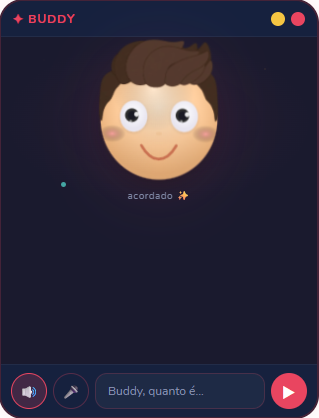

<p align="center">
  
</p>

<h1 align="center">🤖 Buddy Desktop 2.0</h1>

<p align="center">
  <strong>Agente de desktop autônomo com IA multi-provider, controle do computador, browser automation, memória inteligente, catálogo de 44+ tools e sistema de skills.</strong>
</p>

<p align="center">
  
  
  
  
  
  
  
</p>

---

## O que é o Buddy?

Buddy é um agente virtual que fica como uma janelinha sempre visível na sua tela. Ele tem um rostinho animado SVG com expressões, cabelo 3D em PNG, escuta sua voz, conversa usando IA, e executa tarefas completas no seu computador.

Diferente de um chatbot simples, o Buddy é um **agente autônomo**: você dá uma tarefa e ele planeja, executa múltiplos passos, verifica resultados, trata erros e re-planeja se necessário.

---

## O que há de novo no 2.0

| | Funcionalidade | Descrição |
|---|---|---|
| 🧠 | **Agent System** | Planner → Executor → Error Handler com re-planejamento automático |
| 👁️ | **Vision** | Vê sua tela via screenshot + GPT-4o Vision, clica em elementos |
| 🌐 | **Browser** | Playwright com smart actions (IA encontra elementos por descrição) |
| 🔧 | **44+ Tools** | Web search, arquivos, clima, lembretes, YouTube, WhatsApp, código |
| 🧠 | **Memória 2.0** | Extração automática via LLM, JSON estruturado, injeção no prompt |
| ⚙️ | **Settings** | Painel de configurações com persistência |
| 🔌 | **Multi-LLM** | OpenAI + Anthropic (Claude) + Google (Gemini) com fallback |
| 📊 | **Progress UI** | Barra de progresso visual com nome de cada step |

---

## Funcionalidades Completas

| | Funcionalidade | Descrição |
|---|---|---|
| 🎤 | **Voz local** | Vosk (wake word) + faster-whisper (transcrição). 100% offline |
| 🤖 | **Agente autônomo** | Planner/Executor/ErrorHandler com re-planejamento automático |
| 🛡️ | **Proteção destrutiva** | Pede confirmação antes de ações perigosas (configurável) |
| 🧠 | **Memória 2.0** | JSON estruturado + extração automática via LLM + injeção no prompt |
| 📅 | **Scheduler** | Agenda tarefas pra executar em horários específicos |
| 🔧 | **44+ Tools** | Catálogo expandido (screen, browser, search, files, weather, code...) |
| 😊 | **Rostinho SVG** | Rosto animado com 8 expressões + cabelo 3D + antena tech |
| 🔊 | **TTS pt-BR** | Fala as respostas (clique no rosto pra parar) |
| ⚙️ | **Settings** | Painel de configurações com persistência |
| 🔌 | **Multi-LLM** | OpenAI + Anthropic + Google Gemini com fallback automático |
| 📊 | **Progress UI** | Barra de progresso visual com step-by-step |

---

## Catálogo de Tools (44+)

| Categoria | Tools | Arquivo |
|-----------|-------|---------|
| 🖥️ MCP Desktop | execute_command, read_file, write_file, edit_block, list_directory, search_files, search_code, move_file, create_directory | mcp-client.js |
| 👁️ Vision/Screen | screen_capture, screen_describe, screen_find, screen_read_text, screen_click, mouse_click, mouse_move, keyboard_type, keyboard_hotkey, clipboard_copy | actions/screen-capture.js, vision-analyzer.js, computer-control.js |
| 🌐 Browser | browser_go_to, browser_search, browser_click, browser_type, browser_scroll, browser_get_text, browser_press, browser_close, browser_smart_click, browser_smart_type, browser_fill_form | actions/browser-control.js |
| 🔍 Web Search | web_search, web_compare | actions/web-search.js |
| 📂 Files | file_list, file_create, file_delete, file_move, file_copy, file_rename, file_read, file_write, file_find, file_disk_usage | actions/file-controller.js |
| 🌤️ Weather | weather_current, weather_forecast | actions/weather.js |
| ⏰ Reminder | reminder_add, reminder_remove, reminder_list | actions/reminder.js |
| ▶️ YouTube | youtube_search, youtube_play | actions/youtube.js |
| 💬 Messages | send_whatsapp, send_telegram | actions/send-message.js |
| 💻 Code | code_generate, code_run, code_explain, code_edit, code_auto_build | actions/code-helper.js |

---

## Modelos de IA Suportados

| Provider | Modelos | Tool Calling |
|----------|---------|--------------|
| **OpenAI** | gpt-4o-mini, gpt-4o, gpt-4.1, gpt-4.1-mini, gpt-4.1-nano | ✅ |
| **Anthropic** | claude-sonnet-4, claude-haiku-4.5, claude-opus-4 | ✅ |
| **Google** | gemini-2.0-flash, gemini-2.5-pro, gemini-2.5-flash | ⚠️ Parcial |

O fallback automático tenta o próximo provider se o principal falhar.

---

## Arquitetura

```
┌─────────────────────────────────────────────────────┐
│                    ELECTRON (UI)                     │
│  index.html  — Rosto SVG + Chat + Progress bar       │
│  main.js     — Agente + Memória + Scheduler          │
│  preload.js  — Bridge seguro (IPC)                   │
├─────────────────────────────────────────────────────┤
│              AGENT SYSTEM (Buddy 2.0)                │
│  agent/planner.js    — Decompõe goals em steps       │
│  agent/executor.js   — Executa step-by-step          │
│  agent/error-handler — RETRY/SKIP/REPLAN/ABORT       │
│  agent/task-queue.js — Fila com prioridade           │
│  agent/tool-registry — Registro dinâmico de tools    │
├─────────────────────────────────────────────────────┤
│              LLM MULTI-PROVIDER                      │
│  llm-provider.js — OpenAI + Anthropic + Gemini       │
│  settings-manager.js — Configs persistentes          │
├─────────────────────────────────────────────────────┤
│              ACTIONS (44+ tools)                     │
│  actions/screen-capture.js  — Screenshot + sharp     │
│  actions/vision-analyzer.js — GPT-4o Vision          │
│  actions/computer-control.js — Mouse/teclado/clip    │
│  actions/browser-control.js — Playwright             │
│  actions/web-search.js  — DuckDuckGo + Google CSE    │
│  actions/file-controller.js — CRUD de arquivos       │
│  actions/weather.js  — OpenWeatherMap                │
│  actions/reminder.js — Lembretes com persistência    │
│  actions/youtube.js  — Busca e reprodução            │
│  actions/send-message.js — WhatsApp + Telegram       │
│  actions/code-helper.js  — Gerar/rodar/editar código │
├─────────────────────────────────────────────────────┤
│              MEMÓRIA INTELIGENTE 2.0                 │
│  memory/memory-manager.js   — JSON estruturado       │
│  memory/memory-extractor.js — Extração via LLM       │
│  memory/migrate-memory.js   — Migração legado→JSON   │
│  memory/daily/*.md          — Diário (mantido)       │
├─────────────────────────────────────────────────────┤
│              VOICE LISTENER (Python)                 │
│  voice_listener.py — Vosk + faster-whisper           │
├─────────────────────────────────────────────────────┤
│              MCP — Desktop Commander                 │
│  mcp-client.js — JSON-RPC 2.0 via stdio             │
├─────────────────────────────────────────────────────┤
│              SKILLS (Plugins)                        │
│  skills/*.md — Habilidades aprendidas                │
└─────────────────────────────────────────────────────┘
```

---

## Instalação

### Pré-requisitos
- **Node.js** v18+ — https://nodejs.org/
- **Python** 3.10+ — https://www.python.org/
- **API Key** de pelo menos um provider (OpenAI, Anthropic, ou Google)

### Setup

```bash
git clone https://github.com/thescopc/buddy.git
cd buddy
cp main.example.js main.js
# Edite main.js e insira sua API Key (ou configure depois via ⚙️ Settings)
npm install
npm start
```

### Testes

```bash
npm test
```

---

## Como Usar

| Ação | Como |
|---|---|
| **Comando de voz** | Diga "Buddy" + comando |
| **Modo conversa** | Diga "Ativa Buddy" (continua até "Tchau Buddy") |
| **Clique no mic** | Clique 🎤 pra gravar comando |
| **Parar de falar** | Clique no rostinho |
| **Cancelar tarefa** | Clique ✕ durante execução |
| **Esconder/Mostrar** | Ctrl+Shift+B |
| **Configurações** | Clique ⚙️ na barra inferior |

### Exemplos

```
"Buddy, pesquisa sobre IA generativa e salva num arquivo no desktop"
"Buddy, abre o GitHub e faz login"
"Buddy, o que tem na minha tela?"
"Buddy, me lembra às 14:30 de fazer backup"
"Buddy, cria um script Python que baixa imagens"
"Buddy, manda mensagem pro João no WhatsApp"
"Buddy, qual o clima em Uberlândia?"
"Buddy, toca lofi no YouTube"
```

---

## Como Criar Novas Actions

Actions são módulos em `actions/` que adicionam capacidades ao Buddy. Cada action tem dois arquivos:

### 1. O módulo principal (`actions/minha-action.js`)

```javascript
class MinhaAction {
  async executar(params) {
    // Sua lógica aqui
    return { success: true, data: 'resultado' };
  }
}
module.exports = { MinhaAction };
```

### 2. O registro de tools (`actions/register-minha-tools.js`)

```javascript
function registerMinhaTools(toolRegistry) {
  const action = new MinhaAction();
  
  toolRegistry.register({
    name: 'minha_tool',
    description: 'Descrição clara do que faz (usada pelo LLM para decidir quando usar)',
    parameters: {
      type: 'object',
      properties: {
        param1: { type: 'string', description: 'Descrição do parâmetro' }
      },
      required: ['param1']
    },
    execute: async (args) => action.executar(args)
  });
}
module.exports = { registerMinhaTools };
```

### 3. Integrar no `agent/index.js`

```javascript
const { registerMinhaTools } = require('../actions/register-minha-tools');
// Na função initAgent:
registerMinhaTools(toolRegistry);
```

---

## Estrutura de Arquivos

```
buddy/
├── main.example.js      # Arquivo principal (copie como main.js)
├── main.js              # Seu arquivo com API Key (gitignored)
├── preload.js           # Bridge seguro (IPC)
├── index.html           # Interface (SVG face + Chat + Progress + Settings)
├── llm-provider.js      # Multi-provider LLM (OpenAI/Anthropic/Gemini)
├── settings-manager.js  # Gerenciador de configurações
├── settings.json        # Configs persistentes (gitignored)
├── mcp-client.js        # Cliente MCP (JSON-RPC 2.0)
├── voice_listener.py    # Reconhecimento de voz (Python)
├── package.json         # Dependências
├── agent/               # Sistema de Agente Inteligente
│   ├── index.js         # Bootstrap
│   ├── tool-registry.js # Registro dinâmico de tools
│   ├── planner.js       # Decompõe goals em steps
│   ├── executor.js      # Executa step-by-step
│   ├── error-handler.js # RETRY/SKIP/REPLAN/ABORT
│   └── task-queue.js    # Fila com prioridade
├── actions/             # Catálogo de 44+ tools
│   ├── screen-capture.js, vision-analyzer.js, computer-control.js
│   ├── browser-control.js
│   ├── web-search.js, file-controller.js, weather.js
│   ├── reminder.js, youtube.js, send-message.js, code-helper.js
│   └── register-*-tools.js (registros no Tool Registry)
├── memory/              # Memória Inteligente 2.0
│   ├── memory-manager.js    # JSON estruturado
│   ├── memory-extractor.js  # Extração automática via LLM
│   └── migrate-memory.js    # Migração legado → JSON
├── test/                # Testes unitários (47 testes)
│   ├── run.js, test-memory-manager.js
│   ├── test-settings.js, test-llm-provider.js
├── docs/                # Assets
├── skills/              # Skills/Plugins (.md)
└── ROADMAP.md           # Roadmap completo com changelog
```

---

## Licença

Projeto pessoal — use e modifique como quiser.
